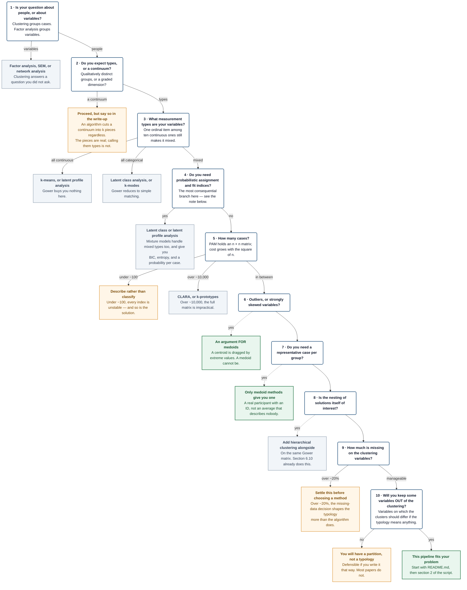

# Does this method fit your problem?

**A decision guide for k-medoids clustering of mixed-type data.**

Part of the [PAM-Gower Pipeline](../README.md). Read this before running
anything. It will sometimes tell you to use something else, which is the point.

---

## Why this guide exists

Cluster analysis is unusually easy to do and unusually hard to do well. Every
algorithm returns clusters, including from data with no group structure at all;
every solution can be given names; and almost every published cluster analysis
reports the solution that was kept without reporting the ones that were not.

So the first question is not *how many clusters* but *whether this method
answers your question*. This guide works through that in ten steps, then
compares the realistic alternatives, then gives you a checklist to run before
you start.

---

## Before the tree: what a cluster is

Three commitments, taken from the methodological literature on cluster analysis
in the social and community sciences — principally Rapkin and Luke (1993) and
Luke (2005). They are worth holding in mind while you work through the tree,
because several of its branches only make sense in their light.

**A clustering algorithm always returns clusters.** PAM will partition random
noise into *k* tidy groups and report a respectable silhouette width for them.
Nothing in the output distinguishes that from real structure. The question is
never "did the algorithm find groups" but "is this partition distinguishable
from what the same algorithm produces on data with no multivariate structure".
Section 6.11 of the pipeline builds that comparison; most published analyses
never make it.

**Clusters are constructed, not discovered.** A solution is the joint product of
the variables you entered, the dissimilarity you chose, the algorithm, and *k*.
Change any one and the typology changes. This is not a flaw to apologise for —
it is a reason to report all four, and to treat the resulting types as useful
heuristics rather than as natural kinds waiting to be found.

**Validity is external.** A partition earns interpretation by relating to
something it was not built from. Internal indices describe the geometry of the
space you constructed; they cannot tell you whether that space corresponds to
anything. This is why node 10 of the tree exists, and why it is the last one.

---

## The decision tree

Follow the spine downwards. A branch to the right leaves this pipeline; a
dashed branch is a reason rather than an exit.

> A rendered version of this diagram, and of everything below, is in
> [`decision_guide.html`](decision_guide.html).

---

## Note on node 4 — the terms, briefly

**Probabilistic assignment** means each case receives a *probability* of
belonging to each group — 0.7 here, 0.2 there, 0.1 elsewhere — instead of a
single label, so borderline cases are visible as borderline and that uncertainty
can be carried into later analyses. **Fit indices** (BIC, AIC, entropy) are
numbers that compare models with different numbers of groups on one common
scale, so the choice of *k* rests on a statistical criterion rather than on
judgement. PAM gives you neither: every case lands in exactly one cluster, and
no index in this pipeline has the standing of a model comparison.

If both matter to your question, use a mixture model — latent class analysis for
categorical indicators, latent profile analysis for continuous ones, and a
mixed-mode mixture for both. What you give up is robustness: mixture models
assume a parametric form for each class, and a misspecified model can produce
classes that are artefacts of the distributional assumption rather than of the
data. The two families fail in different directions, which is why the choice is
worth making deliberately rather than by habit.

---

## Note on node 10 — what "variables to validate on" means

This is the node people most often misread, so it is worth being concrete. It
has nothing to do with checking your references. It is about the **design** of
your variable set.

Suppose you cluster respondents on six variables: three attitude scales, a
categorical affiliation, and two binary indicators. Your clusters will differ on
all six — massively, significantly, with enormous effect sizes. Of course they
will: the algorithm maximised exactly that separation. **That is not weak
evidence. It is no evidence**, and the pipeline refuses to run the test
(section 7.3).

Now suppose you also measured something else — a wellbeing score, a behavioural
outcome, a service-use record — and you deliberately kept it *out* of the
clustering. If the clusters differ on that, you have learned something: the
typology captures a structure that extends beyond the variables that defined it.

That withholding is a real cost. Every interesting variable you keep aside is a
variable that does not shape your typology, and you have to decide in advance
which role each one plays. But it is the only thing that distinguishes a
typology from an arbitrary partition of your sample.

**If you have nothing to withhold**, you can still run the analysis. You will
have a description of how your sample divides on the variables you chose, which
is a legitimate and sometimes sufficient result — for characterising a
population, for designing a stratified sample, for generating hypotheses. What
you will not have is evidence that the division means anything. Report it as a
partition, say plainly that it is unvalidated, and resist the vocabulary of
types. The pipeline will warn you and continue.

---

## The alternatives, compared

The first seven rows extend the comparison most applied researchers start from;
the last four are the ones that usually decide the question.

| | k-means | **k-medoids + Gower** | Hierarchical | LCA / LPA | k-prototypes |
|---|---|---|---|---|---|
| **Data types** | Continuous | **Mixed** | Any, via the chosen distance | LCA categorical, LPA continuous, mixture models both | Mixed |
| **Robustness to outliers** | Low | **High** | Depends on linkage | Model-dependent | Low to moderate |
| **Computation** | Fast | **Slow: an n × n matrix** | Very slow on large n | Moderate; slower with many classes | Fast |
| **Determining k** | Required | **Required** | Not required — read the dendrogram | Required, but guided by fit indices | Required |
| **Scalability** | High | **Moderate (~10,000)** | Low | Moderate | High |
| **Interpretability** | Moderate | **High** | High — the nesting is informative | High — profiles plus probabilities | Moderate |
| **Distance** | Euclidean | **Any, including Gower** | Several | None: likelihood-based | Euclidean plus matching |
| **Distributional assumptions** | Spherical, roughly equal-variance clusters | **None** | None | A parametric model per class; LCA assumes local independence | Implicit |
| **Assignment** | One cluster per case | **One cluster per case** | One cluster per case, at a chosen cut | A probability per case per class | One cluster per case |
| **What the centre is** | A centroid: an average that may describe no one | **A medoid: an actual case** | No centre as such | Class-conditional parameters | Mixed centroid and mode |
| **Model-comparison indices** | No | **No** | No | Yes: BIC, AIC, entropy, bootstrapped LRT | No |

Read the table by column, not by row. There is no method that wins everywhere,
and the bolded column loses on three of the eleven criteria. What it offers is a
particular combination — mixed types, robustness, and an interpretable real-case
centre — bought at the price of scale and of any model-comparison machinery.

### Two more that are sometimes the right answer

**Archetypal analysis** describes cases as mixtures of extreme profiles rather
than assigning them to groups. Useful when your theory says people sit *between*
ideal types rather than *in* categories.

**No clustering at all.** A well-chosen cross-tabulation of two theoretically
central variables is often more informative, more stable and easier to report
than a six-cluster solution, and it is not vulnerable to any of the failure
modes above. This is worth considering seriously before the tree, not after it.

---

## Checklist before you start

Twelve items. If you cannot tick one, it is better to know now.

- [ ] My question is about grouping **cases**, not variables.
- [ ] I can say in one sentence what the typology is **for**.
- [ ] Every clustering variable is there because theory puts it there, and I can say why each one belongs.
- [ ] No construct is entered twice — in particular, no single-choice question has been expanded into one-hot indicators.
- [ ] I have thought about what equal weighting implies, and either accepted it or set weights deliberately.
- [ ] I have enough cases: as a floor, several dozen per expected cluster, and more when the clusters are unequal in size.
- [ ] I know how much data are missing, and I have chosen a route to complete data rather than discovering one mid-analysis.
- [ ] I have at least one variable I am willing to keep **out** of the clustering, for validation.
- [ ] I am prepared to report the solutions I rejected, not only the one I kept.
- [ ] I know what I will do if the permutation reference shows no structure — including the possibility of reporting that.
- [ ] I will be able to name each cluster from its profile, without referring to its number.
- [ ] I have somewhere to deposit the code, the diagnostics and, if ethics permit, the data.

---

## References

Bergman, L. R., & Magnusson, D. (1997). A person-oriented approach in research
on developmental psychopathology. *Development and Psychopathology, 9*(2),
291–319.

Gower, J. C. (1971). A general coefficient of similarity and some of its
properties. *Biometrics, 27*(4), 857–871. https://doi.org/10.2307/2528823

Hennig, C. (2007). Cluster-wise assessment of cluster stability. *Computational
Statistics & Data Analysis, 52*(1), 258–271.
https://doi.org/10.1016/j.csda.2006.11.025

Hennig, C., & Liao, T. F. (2013). How to find an appropriate clustering for
mixed-type variables with application to socio-economic stratification. *Journal
of the Royal Statistical Society: Series C (Applied Statistics), 62*(3),
309–369. https://doi.org/10.1111/j.1467-9876.2012.01066.x

Kaufman, L., & Rousseeuw, P. J. (1990). *Finding groups in data: An introduction
to cluster analysis*. Wiley. https://doi.org/10.1002/9780470316801

Luke, D. A. (2005). Getting the big picture in community science: Methods that
capture context. *American Journal of Community Psychology, 35*(3–4), 185–200.
https://doi.org/10.1007/s10464-005-3397-z

Milligan, G. W., & Cooper, M. C. (1985). An examination of procedures for
determining the number of clusters in a data set. *Psychometrika, 50*(2),
159–179. https://doi.org/10.1007/BF02294245

Rapkin, B. D., & Luke, D. A. (1993). Cluster analysis in community research:
Epistemology and practice. *American Journal of Community Psychology, 21*(2),
247–277. https://doi.org/10.1007/BF00941623

---

*Part of the PAM-Gower Pipeline. Documentation released under
[CC BY 4.0](https://creativecommons.org/licenses/by/4.0/).*
